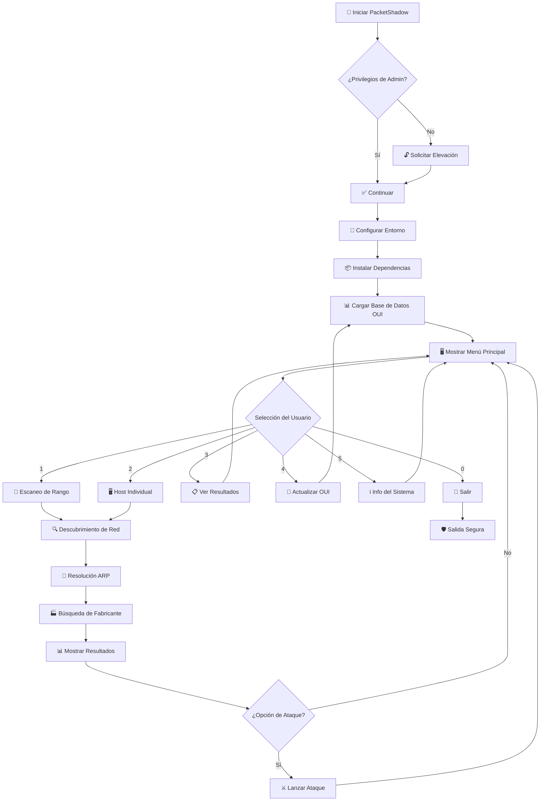

<div align="center">

# 🌐 PacketShadow 🌐

```
   ██████   █████   ██████ ██   ██ ███████ ████████ ███████ ██   ██  █████  ██████   ██████  ██     ██
   ██   ██ ██   ██ ██      ██  ██  ██         ██    ██      ██   ██ ██   ██ ██   ██ ██    ██ ██     ██
   ██████  ███████ ██      █████   █████      ██    ███████ ███████ ███████ ██   ██ ██    ██ ██  █  ██
   ██      ██   ██ ██      ██  ██  ██         ██         ██ ██   ██ ██   ██ ██   ██ ██    ██ ██ ███ ██
   ██      ██   ██  ██████ ██   ██ ███████    ██    ███████ ██   ██ ██   ██ ██████   ██████   ███ ███ 

                        ╔═══════════════════════════════════════════╗
                        ║       Escáner de Red Avanzado             ║
                        ║         por DarK v0.1                     ║
                        ╚═══════════════════════════════════════════╝

[+] Herramienta de Reconocimiento de Red e Identificación de Dispositivos
[+] Suite de Pruebas de Penetración de Grado Empresarial
[+] Integración de Base de Datos IEEE OUI
[+] Configuración Manual de Red
```
</div>

<div align="center">

**🎯 Herramienta Avanzada de Reconocimiento de Red e Identificación de Dispositivos**

*Suite de pruebas de penetración de grado empresarial con integración de base de datos IEEE OUI*

**Versión:** 2.1 | **Python:** 3.8+ | **Plataforma:** Windows, Linux, macOS | **Licencia:** MIT

[🚀 Instalación](#-instalación) • 
[💻 Uso](#-uso) • 
[🏗️ Estructura del Proyecto](#️-estructura-del-proyecto) • 
[🛡️ Descargo de Responsabilidad](#️-descargo-de-responsabilidad) • 
[🤝 Contribuir](#-contribuir) • 
[🔍 Solución de Problemas](#-solución-de-problemas)

</div>

---

## 🌟 Visión General

<details>
<summary>📋 <strong>¿Qué es PacketShadow?</strong></summary>

PacketShadow es una herramienta sofisticada de reconocimiento de red diseñada para profesionales de ciberseguridad, administradores de red y hackers éticos. Proporciona capacidades avanzadas de mapeo de red, identificación de dispositivos mediante la base de datos IEEE OUI, y funciones de pruebas de penetración como ARP spoofing y desautenticación WiFi (en Linux).

**Características Clave:**
- 🔍 **Descubrimiento de Red**: Detección multihilo de hosts activos.
- 🏷️ **Identificación de Dispositivos**: Reconocimiento de fabricantes vía direcciones MAC.
- 🎯 **Escaneo Dirigido**: Escaneo de rangos IP o hosts individuales.
- 🔧 **Multiplataforma**: Compatible con Windows, Linux y macOS.
- ⚔️ **Pruebas de Penetración**: Ataques controlados para pruebas autorizadas.
- 🛡️ **Enfoque Ético**: Diseñado con principios de uso responsable.

</details>

## ✨ Características

<div align="center">

| Característica | Descripción | Estado |
|----------------|-------------|---------|
| 🌐 **Escaneo de Red** | Descubrimiento de hosts multihilo | ✅ |
| 🔍 **Resolución MAC** | Detección de direcciones de hardware vía ARP | ✅ |
| 🏭 **ID de Fabricante** | Integración con base de datos IEEE OUI | ✅ |
| 💻 **Multiplataforma** | Soporte para Windows, Linux, macOS | ✅ |
| 🎯 **Ataques Dirigidos** | ARP spoofing (Windows/Linux) y desautenticación WiFi (Linux, modo monitor) | ✅ |
| 📊 **Salida Enriquecida** | Tablas formateadas con colores | ✅ |
| 🔧 **Configuración Automática** | Gestión de entorno virtual y dependencias | ✅ |
| 🛡️ **Gestión de Permisos** | Escalación automática de privilegios | ✅ |

</div>

## 🚀 Instalacion

<summary>🔧 <strong>Configuración Rápida</strong></summary>

### Prerrequisitos
- **Python**: 3.8 o superior.
- **Privilegios**: Acceso de administrador/root.
- **Conexión a internet**: Para descargar dependencias.
- **Windows**: [Npcap](https://nmap.org/npcap/) para operaciones de red con Scapy.
- **Linux**: Adaptador WiFi compatible con modo monitor para ataques de desautenticación (ej. chipsets Atheros AR9271, Ralink RT3070).


### 1. Clonar el Repositorio
```bash
git clone https://github.com/BrandonMieres/PacketShadow.git
cd PacketShadow
```

### 2. Ejecutar PacketShadow
```bash
# La aplicación automáticamente:
# - Verificará permisos de administrador
# - Creará un entorno virtual
# - Instalará dependencias
# - Lanzará la interfaz principal

python main.py
```

**Nota**: Si la creación del entorno virtual falla (por ejemplo, por permisos o espacio en disco), el programa intentará ejecutarse en el entorno actual, pero algunas funcionalidades pueden no estar disponibles.

### 3. Configuración Manual (Opcional)
```bash
# Crear entorno virtual
python -m venv venv

# Activar entorno virtual
# Windows:
venv\Scripts\activate
# Linux/macOS:
source venv/bin/activate

# Instalar dependencias
pip install -r requirements.txt
```

**Nota**: Si existe un archivo `requirements.txt`, se instalarán las dependencias adicionales listadas en él.


## 💻 Uso

### 🎮 Menú Interactivo

<details>
<summary>🖥️ <strong>Interfaz Principal</strong></summary>

PacketShadow ofrece una interfaz basada en menús intuitiva:

```
╔══════════════════════════════════════════════════════════╗
║              MENÚ PRINCIPAL                              ║
╚══════════════════════════════════════════════════════════╝

[1] 🎯 Escanear rango personalizado
[2] 🖥️ Escanear IP específica
[3] 📋 Ver últimos resultados
[4] 🔄 Actualizar base de datos OUI
[5] ℹ️ Información del sistema
[0] ⚠ Salir
```

</details>

### 📡 Opciones de Escaneo

<details>
<summary>🎯 <strong>Escaneo de Rango de Red</strong></summary>

**Escaneo de Rango Personalizado:**
```bash
# Ejemplos de notación CIDR:
192.168.1.0/24    # Escanear subred doméstica (254 hosts)
10.0.0.0/16       # Red corporativa grande
172.16.0.0/20     # Red de tamaño medio
```

**Escaneo de Host Individual:**
```bash
# Dirigirse a dispositivos específicos:
192.168.1.1       # Router/Puerta de enlace
192.168.1.100     # Estación de trabajo específica
10.0.0.50         # Servidor
```

</details>

### 🎭 Características Avanzadas

<details>
<summary>⚔️ <strong>Disrupción de Red</strong></summary>

**Suplantación ARP (Windows y Linux):**
- Ataques de intermediario para pruebas autorizadas.
- Disrupción de conexiones mediante paquetes ARP falsificados.

**Ataques de Desautenticación WiFi (Solo Linux, Modo Monitor):**
- Desconexión de clientes WiFi en redes autorizadas.
- Requiere un adaptador WiFi compatible con modo monitor.

**Nota**: Los ataques de desautenticación no están disponibles en Windows, que utiliza ARP spoofing como alternativa. Ambas funciones requieren permisos de administrador y confirmación explícita del usuario.

</details>

### 🖥️ Casos de Uso Prácticos

- **Red Doméstica**: Escanea `192.168.1.0/24` para identificar dispositivos desconocidos conectados a tu WiFi.
- **Pruebas de Seguridad**: Usa la opción de escaneo de IP específica para verificar la configuración de un servidor crítico.
- **Auditorías Autorizadas**: Realiza ataques controlados (ARP spoofing o desautenticación) para evaluar la resiliencia de una red con permiso explícito.

## 🏗️ Estructura del Proyecto

```
PacketShadow/
├── 📜 main.py                    # Punto de entrada principal
├── 📋 requirements.txt           # Dependencias de Python (opcional)
├── 📁 modules/
│   ├── 🌐 red.py                # Escaneo y descubrimiento de red
│   └── ⚔️ authattack.py         # Ataques y disrupción de red
└── 📁 OUI/
    └── 📊 ieee-oui.txt          # Base de datos de fabricantes IEEE OUI
```

### 🔧 Componentes Principales

<details>
<summary>📦 <strong>Desglose de Módulos</strong></summary>

**main.py**
- Configuración inicial y gestión de permisos.
- Creación automática del entorno virtual.
- Sistema de menú interactivo.
- Manejo robusto de errores.

**modules/red.py**
- Escaneo multihilo de redes y hosts individuales.
- Resolución de direcciones MAC y nombres de host.
- Integración con la base de datos OUI.
- Visualización de resultados en tablas coloreadas.

**modules/authattack.py**
- Implementación de ARP spoofing y desautenticación WiFi.
- Verificación de interfaces y permisos.
- Advertencias éticas antes de cada ataque.

**OUI/ieee-oui.txt**
- Base de datos de Identificadores Únicos Organizacionales (OUI) de IEEE.
- Mapea direcciones MAC a fabricantes.

</details>

## 🔄 Diagrama de Flujo de Trabajo



## 🖥️ Ejemplo de Salida

<details>
<summary>📋 <strong>Ejemplo de Resultados de Escaneo</strong></summary>

```
╔══════════════════════════════════════════════════════════════════════════════════════════════════════╗
║                                       DISPOSITIVOS DETECTADOS                                         ║
╚══════════════════════════════════════════════════════════════════════════════════════════════════════╝

#   Dirección IP    Dirección MAC      Nombre de Host           Fabricante                     Estado
── ─── ─────────── ─────────────────── ────────────────────── ────────────────────────────── ──────────
1   192.168.1.1    30:16:9D:24:5C:34  Router.local         Cisco Systems, Inc             Activo
2   192.168.1.50   B8:27:EB:A3:21:4F  raspberry-pi.local   Raspberry Pi Foundation        Activo
3   192.168.1.100  No disponible       N/A                  Fabricante desconocido          Activo
4   192.168.1.25   B0:5B:99:AB:CD:EF  N/A                  Sagemcom Broadband SAS         Activo

[✓] Estadísticas del escaneo:
  ► Total de dispositivos: 4
  ► Dispositivos con MAC: 3
  ► Dispositivos con hostname: 2
  ► Fabricantes únicos: 3
```

**Nota**: Los campos 'Dirección MAC', 'Nombre de Host' o 'Fabricante' pueden mostrar 'No disponible' o 'N/A' si el dispositivo no responde a ARP o no está en la base de datos OUI.

</details>

## 🛡️ Descargo de Responsabilidad

<div align="center">

### ⚠️ **Solo Uso Ético** ⚠️

PacketShadow está diseñado para pruebas autorizadas y propósitos educativos. Los usuarios deben:
- ✅ Obtener permiso explícito antes de probar cualquier red.
- ✅ Cumplir con las leyes locales.
- ❌ **Evitar** el uso para actividades maliciosas.

El escaneo o ataques no autorizados pueden violar leyes locales. Los desarrolladores no son responsables del mal uso de esta herramienta.

</div>

## 🔒 Características de Seguridad

<details>
<summary>🛡️ <strong>Protecciones Integradas</strong></summary>

- **Advertencias Éticas**: Confirmaciones obligatorias para funciones de ataque.
- **Verificaciones de Permisos**: Validación automática de privilegios de administrador.
- **Manejo de Errores**: Gestión robusta de excepciones para evitar fallos.
- **Parámetros Seguros**: Configuraciones conservadoras para escaneos y ataques.
- **Modo Degradado**: Continúa ejecutándose con funcionalidades limitadas si faltan dependencias.

</details>

## 📋 Requisitos

### Requisitos del Sistema
- **SO**: Windows 10+, Linux (Ubuntu 18+), macOS 10.14+.
- **Python**: 3.8 o superior.
- **RAM**: 512 MB mínimo, 1 GB recomendado.
- **Privilegios**: Acceso de administrador/root.
- **Windows**: Npcap para Scapy ([descargar](https://nmap.org/npcap/)).
- **Linux**: Adaptador WiFi compatible con modo monitor para desautenticación.

### Dependencias de Python
```txt
scapy==2.5.0          # Manipulación de paquetes de red
colorama==0.4.6       # Texto de terminal coloreado
requests==2.31.0      # Biblioteca HTTP para actualizaciones
setuptools==70.0.0    # Utilidades de gestión de paquetes
```

## 🔍 Solución de Problemas

<details>
<summary>🛠️ <strong>Problemas Comunes</strong></summary>

- **No se detectan dispositivos**:
  - Verifica que tienes permisos de administrador (`sudo` en Linux, UAC en Windows).
  - Asegúrate de que estás conectado a la red objetivo.
- **Error al cargar OUI**:
  - Confirma que `OUI/ieee-oui.txt` existe y tiene el formato correcto (`XX:XX:XX (hex) Nombre del Fabricante`).
  - Descarga el archivo desde [http://standards-oui.ieee.org/oui.txt](http://standards-oui.ieee.org/oui.txt).
- **Errores con Scapy**:
  - En Windows, instala Npcap desde [https://nmap.org/npcap/](https://nmap.org/npcap/).
  - En Linux, instala `libpcap` con `sudo apt install libpcap-dev`.
- **Ataque de desautenticación falla**:
  - Confirma que la interfaz está en modo monitor (usa `iwconfig` en Linux).
  - Verifica que el adaptador WiFi es compatible con modo monitor.
- **Entorno virtual no se activa**:
  - Windows: Asegúrate de que el prompt muestra `(venv)`.
  - Linux/macOS: Usa `echo $VIRTUAL_ENV` para confirmar.

</details>

## 🤝 Contribuir

<details>
<summary>💡 <strong>Cómo Contribuir</strong></summary>

¡Damos la bienvenida a contribuciones de la comunidad! Aquí tienes cómo ayudar:

### 🐛 Reportes de Errores
- Usa GitHub Issues para reportar problemas.
- Incluye pasos detallados, información del sistema, y registros de errores.

### 🔧 Solicitudes de Características
- Propón nuevas funciones vía GitHub Issues.
- Explica el caso de uso y beneficios.

### 📝 Contribuciones de Código
1. Haz fork del repositorio.
2. Crea una rama: `git checkout -b feature/nueva-caracteristica`.
3. Confirma cambios: `git commit -m 'Agrega nueva característica'`.
4. Empuja la rama: `git push origin feature/nueva-caracteristica`.
5. Abre un Pull Request.

### 📚 Documentación
- Mejora el `readme.md` o agrega ejemplos.
- Traduce a otros idiomas (por ejemplo, inglés).

</details>

## 📈 Hoja de Ruta

<details>
<summary>🗓️ <strong>Desarrollo Futuro</strong></summary>

- **Soporte para IPv6**: Escaneo y análisis de redes IPv6.
- **Exportación de Resultados**: Guardar resultados en CSV o JSON.
- **Optimización de Rendimiento**: Mejoras en el escaneo de redes grandes.
- **Nuevas Técnicas de Prueba**: Integración de métodos éticos adicionales.
- **Interfaz Gráfica**: Opcional GUI para usuarios no técnicos.

</details>

## 📊 Estadísticas del Proyecto

<div align="center">

| Métrica | Descripción |
|---------|-------------|
| 🐍 **Lenguaje** | Python 3.8+ |
| 📦 **Dependencias** | 4 paquetes principales |
| 🗂️ **Módulos** | 2 módulos especializados |
| 📊 **Base de Datos OUI** | Miles de entradas de fabricantes IEEE |
| 🌍 **Soporte de Plataforma** | Windows, Linux, macOS |
| ⚡ **Rendimiento** | Escaneo multihilo |

</div>

## 🏆 Reconocimientos

<details>
<summary>👏 <strong>Créditos y Agradecimientos</strong></summary>

- **IEEE** por la base de datos OUI.
- **Equipo de Scapy** por la biblioteca de manipulación de paquetes.
- **Comunidad de Python** por el ecosistema robusto.
- **Hackers Éticos** por promover la divulgación responsable.
- **Contribuidores** que mejoran PacketShadow.

</details>

## 📄 Licencia

```
Licencia MIT

Copyright (c) 2024 Brandon Mieres

Se concede permiso, libre de cargos, a cualquier persona que obtenga una copia
de este software y de los archivos de documentación asociados (el "Software"), 
para utilizar el Software sin restricción, incluyendo sin limitación los derechos
a usar, copiar, modificar, fusionar, publicar, distribuir, sublicenciar, y/o vender
copias del Software, y a permitir a las personas a las que se les proporcione el
Software a hacer lo mismo, sujeto a las siguientes condiciones:

El aviso de copyright anterior y este aviso de permiso se incluirán en todas las
copias o partes sustanciales del Software.

EL SOFTWARE SE PROPORCIONA "COMO ESTÁ", SIN GARANTÍA DE NINGÚN TIPO, EXPRESA O
IMPLÍCITA, INCLUYENDO PERO NO LIMITADO A GARANTÍAS DE COMERCIALIZACIÓN,
IDONEIDAD PARA UN PROPÓSITO PARTICULAR E INCUMPLIMIENTO. EN NINGÚN CASO LOS
AUTORES O PROPIETARIOS DE LOS DERECHOS DE AUTOR SERÁN RESPONSABLES DE NINGUNA
RECLAMACIÓN, DAÑOS U OTRAS RESPONSABILIDADES, YA SEA EN UNA ACCIÓN DE CONTRATO,
AGRAVIO O CUALQUIER OTRO MOTIVO, DERIVADAS DE, FUERA DE O EN CONEXIÓN CON EL
SOFTWARE O SU USO U OTRO TIPO DE ACCIONES EN EL SOFTWARE.
```

---

<div align="center">

**Hecho con ❤️ por [Brandon Mieres](https://github.com/BrandonMieres)**

*Si PacketShadow te ayudó, ¡por favor considera darle una ⭐!*

[⬆️ Volver Arriba](#-packetshadow)

</div>
